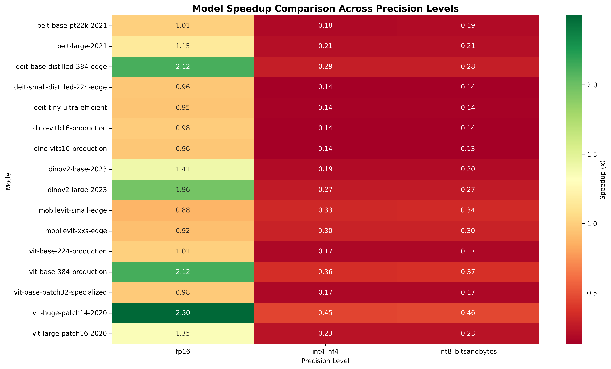
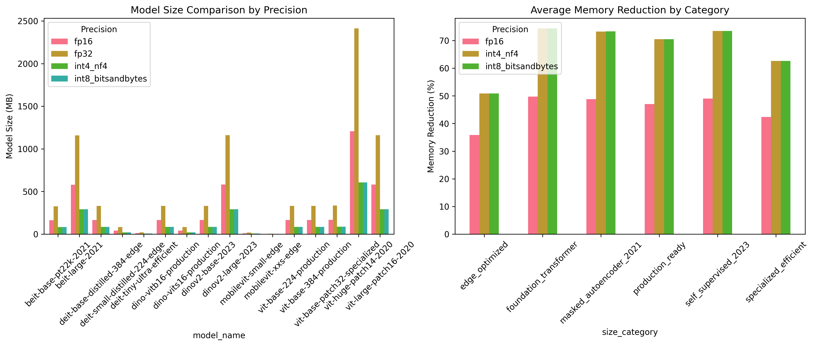
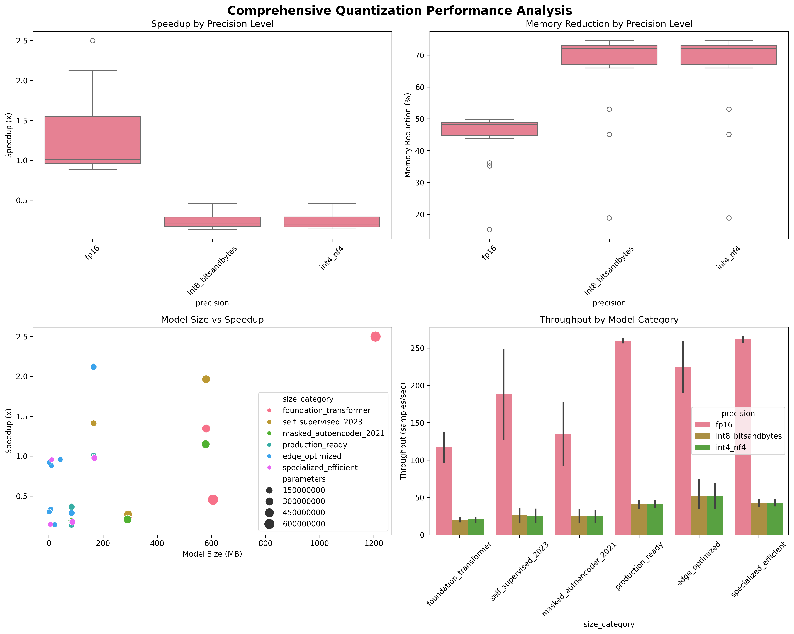

Quantization is usually pitched as a free lunch: lower precision, smaller model, faster inference. I wanted to know how much of that holds for vision transformers on a single consumer GPU, so I ran 16 models from the ViT family through four precision settings and measured latency and memory.

The short version: FP16 is worth turning on, but for its memory savings more than its speed. And the INT8 mode that's easiest to reach for in the Hugging Face ecosystem made everything slower.

## What I tested

| | |
|---|---|
| **GPU** | 1 × NVIDIA GeForce RTX 4070 Ti SUPER, 16 GB |
| **Software** | PyTorch 2.1, CUDA 12.1, bitsandbytes 0.42.0, Hugging Face Transformers and timm |
| **Models** | 16 vision transformers from 2020–2023 (ViT, DeiT, BEiT, DINO, DINOv2, MobileViT), 1.3M–632M parameters. Checkpoints are listed in the [full results](#full-results) |
| **Precisions** | FP32 (baseline); FP16 via `model.half()`; INT8 via bitsandbytes; INT4 NF4 via bitsandbytes |
| **Measurement** | Batch size 1. Latency is the mean over 1,000 iterations; peak GPU memory and weight size were recorded per configuration. 64 configurations in total |

Every measurement is at **batch size 1**: throughput equals 1000 ÷ latency in every row of the results. That's the regime of an online service that answers one image per request, and it matters a lot for how to read the numbers below.

## FP16: half the memory, and speed only when there's enough work

The models below are sorted by FP32 latency, which serves as a rough measure of how much work one forward pass does.

| Model | Params | Input | FP32 | FP16 | Speedup |
|---|---:|---:|---:|---:|---:|
| ViT-Huge/14 | 632M | 224 px | 25.59 ms | 10.24 ms | **2.50×** |
| DINOv2-Large | 300M | 224 px | 15.27 ms | 7.78 ms | **1.96×** |
| BEiT-Large | 307M | 224 px | 12.31 ms | 10.71 ms | 1.15× |
| ViT-Large/16 | 307M | 224 px | 9.84 ms | 7.31 ms | 1.35× |
| ViT-Base/16 @384 | 86M | 384 px | 8.07 ms | 3.80 ms | **2.12×** |
| DeiT-Base distilled @384 | 87M | 384 px | 8.07 ms | 3.81 ms | **2.12×** |
| BEiT-Base | 86M | 224 px | 5.70 ms | 5.67 ms | 1.01× |
| DINOv2-Base | 86M | 224 px | 5.69 ms | 4.03 ms | 1.41× |
| MobileViT-XXS | 1.3M | 256 px | 5.15 ms | 5.59 ms | 0.92× |
| MobileViT-S | 5.6M | 256 px | 4.32 ms | 4.91 ms | 0.88× |
| ViT-Base/16 | 86M | 224 px | 3.83 ms | 3.81 ms | 1.01× |
| DINO ViT-B/16 | 86M | 224 px | 3.82 ms | 3.88 ms | 0.98× |
| DeiT-Small distilled | 22M | 224 px | 3.77 ms | 3.94 ms | 0.96× |
| DINO ViT-S/16 | 22M | 224 px | 3.74 ms | 3.89 ms | 0.96× |
| DeiT-Tiny | 5.7M | 224 px | 3.69 ms | 3.87 ms | 0.95× |
| ViT-Base/32 | 86M | 224 px | 3.69 ms | 3.78 ms | 0.98× |



### The 3.8 ms floor

The bottom six rows are the most telling. DeiT-Tiny (5.7M parameters) and ViT-Base/16 (86M parameters) took essentially the same time: 3.69 and 3.83 ms. A model 15 times larger ran no slower, so latency at this scale isn't set by arithmetic. It's set by fixed per-call costs such as launching the GPU kernels for every layer and the Python and framework code around each call. No model got below **3.78 ms** in FP16.

That explains the pattern in the table:

- **Models well above the floor got real speedups.** The heaviest forward passes (ViT-Huge, DINOv2-Large and the two 384-pixel models) ran 1.96–2.50× faster, because FP16 matrix multiplications run on the GPU's Tensor Cores and move half as much data. The 384-pixel models process about three times as many image patches as their 224-pixel versions, which is enough work for FP16 to matter.
- **Models at the floor gained nothing.** With no arithmetic bottleneck to relieve, several came out 2–5% slower, and the MobileViT models, which mix convolutions with attention, were 8–12% slower.
- **Architecture matters too.** BEiT-Large and ViT-Large are the same size as DINOv2-Large and have comparable FP32 latencies, but gained only 1.15× and 1.35×. Parameter count alone won't predict the speedup, so benchmark your own model.

Batching several images per call would raise every model's work per call and probably extend the FP16 speedups to smaller models. I didn't test that here.

## Memory: FP16 halves it, INT8 quarters it (for large models)

| Model | Params | FP32 | FP16 | INT8 | Weights (FP32 → INT8) |
|---|---:|---:|---:|---:|---:|
| ViT-Huge/14 | 632M | 2,421 MB | 1,214 MB (−50%) | 616 MB (−75%) | 2,412 → 606 MB |
| ViT-Large/16 | 307M | 1,169 MB | 589 MB (−50%) | 302 MB (−74%) | 1,161 → 292 MB |
| BEiT-Large | 307M | 1,166 MB | 588 MB (−50%) | 300 MB (−74%) | 1,157 → 291 MB |
| DINOv2-Large | 300M | 1,169 MB | 589 MB (−50%) | 302 MB (−74%) | 1,161 → 293 MB |
| DeiT-Base distilled @384 | 87M | 341 MB | 177 MB (−48%) | 96 MB (−72%) | 331 → 84 MB |
| ViT-Base/32 | 86M | 344 MB | 177 MB (−49%) | 96 MB (−72%) | 336 → 87 MB |
| ViT-Base/16 @384 | 86M | 341 MB | 177 MB (−48%) | 96 MB (−72%) | 331 → 84 MB |
| ViT-Base/16 | 86M | 340 MB | 176 MB (−48%) | 95 MB (−72%) | 330 → 84 MB |
| DINO ViT-B/16 | 86M | 340 MB | 176 MB (−48%) | 95 MB (−72%) | 330 → 84 MB |
| DINOv2-Base | 86M | 339 MB | 175 MB (−48%) | 93 MB (−73%) | 330 → 84 MB |
| BEiT-Base | 86M | 336 MB | 174 MB (−48%) | 93 MB (−72%) | 327 → 83 MB |
| DINO ViT-S/16 | 22M | 94 MB | 52 MB (−44%) | 32 MB (−66%) | 83 → 21 MB |
| DeiT-Small distilled | 22M | 91 MB | 50 MB (−45%) | 30 MB (−68%) | 83 → 21 MB |
| DeiT-Tiny | 5.7M | 29 MB | 19 MB (−36%) | 14 MB (−53%) | 21 → 6 MB |
| MobileViT-S | 5.6M | 27 MB | 18 MB (−35%) | 15 MB (−45%) | 19 → 7 MB |
| MobileViT-XXS | 1.3M | 12 MB | 10 MB (−15%) | 10 MB (−19%) | 4 → 1 MB |

Peak memory at batch size 1 is almost exactly **the weights plus a fixed 8–10 MB**. Activations for a single image are tiny. So the savings track the weights: FP16 halves them and INT8 quarters them. For large models that means −50% and −75% of peak memory. For the smallest models the fixed 8–10 MB dominates, so the relative saving shrinks, down to −15% (FP16) and −19% (INT8) for MobileViT-XXS.



## INT8 with bitsandbytes: smaller, but much slower

| Model | FP32 | INT8 | Relative speed |
|---|---:|---:|---:|
| ViT-Huge/14 | 25.59 ms | 56.14 ms | 0.46× |
| DINOv2-Large | 15.27 ms | 56.68 ms | 0.27× |
| BEiT-Large | 12.31 ms | 59.32 ms | 0.21× |
| ViT-Large/16 | 9.84 ms | 43.56 ms | 0.23× |
| ViT-Base/16 @384 | 8.07 ms | 21.86 ms | 0.37× |
| DeiT-Base distilled @384 | 8.07 ms | 28.51 ms | 0.28× |
| BEiT-Base | 5.70 ms | 30.20 ms | 0.19× |
| DINOv2-Base | 5.69 ms | 29.01 ms | 0.20× |
| MobileViT-XXS | 5.15 ms | 16.91 ms | 0.30× |
| MobileViT-S | 4.32 ms | 12.76 ms | 0.34× |
| ViT-Base/16 | 3.83 ms | 21.89 ms | 0.17× |
| DINO ViT-B/16 | 3.82 ms | 27.53 ms | 0.14× |
| DeiT-Small distilled | 3.77 ms | 26.91 ms | 0.14× |
| DINO ViT-S/16 | 3.74 ms | 28.45 ms | 0.13× |
| DeiT-Tiny | 3.69 ms | 25.73 ms | 0.14× |
| ViT-Base/32 | 3.69 ms | 21.30 ms | 0.17× |

Every model got slower, by 2.2× (ViT-Huge) to 7.6× (DINO ViT-S/16). That isn't a bug in the benchmark. bitsandbytes' 8-bit mode was built to fit large language models into limited GPU memory, and it adds quantize and dequantize work around every matrix multiplication. With one small image per call, that extra work outweighs any gain from 8-bit arithmetic.



## INT4: no usable results

The INT4 runs were meant to use bitsandbytes' 4-bit NF4 format with double quantization. Every one of them recorded `bitsandbytes_int8_success` as the method actually used, with memory identical to the INT8 run, so these rows are effectively a second INT8 measurement. This study has nothing to say about INT4. Measuring it properly is on the list for a follow-up.

## Recommendations

1. **Turn on FP16 for GPU inference, mainly to save memory.** It cut peak memory by 44–50% for every model of 22M parameters and up. Expect a speedup only when a single forward pass is expensive: here, mostly the models that took 8 ms or more in FP32.
2. **If you're near the ~4 ms floor, cut overhead instead of precision.** Batch requests together, keep inputs on the GPU, and look at `torch.compile` or CUDA graphs. (I didn't test these here.)
3. **Use bitsandbytes INT8 only to fit a model that otherwise won't fit.** Budget for inference that is 2–8× slower. For *fast* INT8, use an inference engine with INT8 kernels, such as TensorRT (also not tested here).
4. **Measure accuracy yourself.** This study didn't, and lower precision can change predictions.

Here's how to set up each precision with Hugging Face Transformers:

```python
import torch
from transformers import AutoModel, BitsAndBytesConfig

name = "google/vit-base-patch16-384"

# FP16: convert the weights, and feed FP16 inputs
model_fp16 = AutoModel.from_pretrained(name).eval().half().cuda()
pixels = torch.randn(1, 3, 384, 384, device="cuda", dtype=torch.float16)
with torch.inference_mode():
    features = model_fp16(pixel_values=pixels).last_hidden_state

# INT8 with bitsandbytes: much smaller, much slower (see above)
model_int8 = AutoModel.from_pretrained(
    name,
    quantization_config=BitsAndBytesConfig(load_in_8bit=True),
    device_map="auto",
)

# 4-bit NF4, the configuration this study attempted
nf4 = BitsAndBytesConfig(
    load_in_4bit=True,
    bnb_4bit_quant_type="nf4",
    bnb_4bit_use_double_quant=True,
    bnb_4bit_compute_dtype=torch.float16,
)
```

After loading a quantized model, check what you actually got. Compare `model.get_memory_footprint()` with the FP32 model, and look at which layer classes are in the model. That check would have caught the INT4 fallback in this study.

## Limitations

- **Batch size 1 only.** Batched inference would raise the work per call and change the FP16 picture.
- **No accuracy measurements.** The `simulated_accuracy` (0.85) and `stability_score` (0.95) columns in the data are constant placeholders.
- **No INT4 results**, because of the fallback described above.
- **One GPU and one software stack** (PyTorch 2.1, bitsandbytes 0.42.0). Newer versions of both have changed their 8-bit and 4-bit kernels.
- **One measured configuration per model and precision.** The latency is an average over 1,000 iterations, but run-to-run variance wasn't recorded.

## Full results

The tables above include every model. These are the checkpoints used, all from Hugging Face:

| Model | Checkpoint | Input |
|---|---|---:|
| ViT-Huge/14 | `google/vit-huge-patch14-224-in21k` | 224 px |
| ViT-Large/16 | `google/vit-large-patch16-224-in21k` | 224 px |
| BEiT-Large | `microsoft/beit-large-patch16-224` | 224 px |
| DINOv2-Large | `facebook/dinov2-large` | 224 px |
| DINOv2-Base | `facebook/dinov2-base` | 224 px |
| BEiT-Base | `microsoft/beit-base-patch16-224-pt22k-ft22k` | 224 px |
| ViT-Base/16 @384 | `google/vit-base-patch16-384` | 384 px |
| ViT-Base/16 | `google/vit-base-patch16-224-in21k` | 224 px |
| ViT-Base/32 | `google/vit-base-patch32-224-in21k` | 224 px |
| DINO ViT-B/16 | `facebook/dino-vitb16` | 224 px |
| DINO ViT-S/16 | `facebook/dino-vits16` | 224 px |
| DeiT-Base distilled @384 | `facebook/deit-base-distilled-patch16-384` | 384 px |
| DeiT-Small distilled | `facebook/deit-small-distilled-patch16-224` | 224 px |
| DeiT-Tiny | `facebook/deit-tiny-patch16-224` | 224 px |
| MobileViT-S | `timm/mobilevit_s.cvnets_in1k` | 256 px |
| MobileViT-XXS | `apple/mobilevit-xx-small` | 256 px |

Throughput, weight sizes and the method each configuration actually used are in the [raw CSV](data/quantization_results.csv). The [data dictionary](data/README.md) explains every column.

---

*Revision, September 2026:* rewritten around the committed data. Earlier versions of this page listed models that weren't part of the study (ConvNeXt, EfficientNet, ResNet, MobileNetV3), per-model accuracy drops, an RTX 4090 test platform, and ROI and payback figures. None of those were measured, so they've been removed. The INT8 slowdown and the INT4 fallback, which the earlier versions left out, are now reported. The previous long-form write-up (`comprehensive_quantization_study.md` and `technical_supplement_quantization.md`) was merged into this page.
